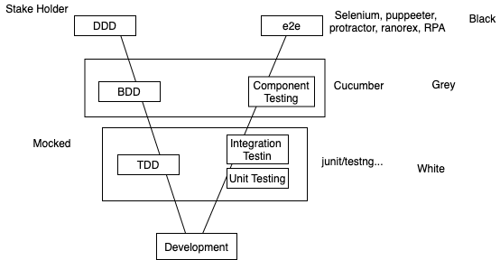

 
Classroom Session - The Full stack: Design Patterns - 1
(9th Sept)	

a) Architecture - High Level Architecture Layers and Building blocks
b) Design Principlets
    1) Revision of basic OO Concepts, Why Patterns
    2) SOLID Principles
    3)  Creational Patterns - Abstract Factory, Factory Method, Builder	4
Classroom Session - The Full stack: Design Patterns - 2
(9th Sept)	    4)  Behavioural Patterns - Decorator, Adaptor, Proxy, Composite
    5)  Structural Patterns - Strategy, Command, Iterator, Observer, Visitor
Build a Small application to connect to database and retrieve data	
 


Learn 
Implement 


20 to 25% - Coding 


naveenks.com

10 days - 

DBMS - RDBMS, MySQL, 
NoSQL - MongoDB, with command propmt, 
Agile - Scrum, sprint, kanban 


Abhishek chaturvedi - CS, 6, 
Abhishek Parmar - IT, 3 
Anshul - IT, 5 
Arghyadeep - CS, 6 
Diya - CS, 5 
Ishwar - IT, 5
Kasturi - CS, 5
Manvi - CS, 5 
Meeti - IT, 5.5 
Mhosin - CS, 6.5
Neel - CS, 5 
Nikita - CS, 5
Raj - CS, 5
Sahil - CS, 6
Santoshi - EC, 4
Shailesh - CS, 5
Shivam - CS, 5 
Shubham - CS, 5 
sreya - CS, 5
Swetlana - CS, 5
vaishnavi - CS, 5
Vidya - CS, 6


90% - Practicles 
	Java 8, 11
	Eclipse (using)
	VS Code 
	IntelliJ
	NetBeans 

	MySQL 

10% - Theory 


1 Tier 
2 Tier 
3 Tier 
N Tier 


Left To Right Approach 
	C 
	
	void main() {
		int a, b, res;
		printf("Hello World"); 
		printf("Enter a Number"); 
		scanf("%d", & a);

		printf("Enter a Number"); 
		scanf("%d", &b);
		
		res = a+b;
		
	}
	
	
Right To Left Approach 

Given the application is loaded on http://barclays.com
When user enters username 
And Password in the given field 
And hits submit button 
Then validate the credentials 
Then show home page 


Scalability 

Horizontal Scalability 
	clusters 
	
Vertical Scalability 
	10m - min - Buy more RAM, buy more HDD, buy more cahce 


Anti Pattern 

	if you have a bulky code its good to break that in to smaller pieces 
		so you can maintain easily 


Design Patterns 


SOLID Priciples 


class Emp {
	private int empId; 
	private Name name; 
	private double salary; 
	private Address address; 
	private Company company;
	... 
}

class Name {
	private String firstName; 
	private String lastName; 

}

class Companay {
	private int cId; 
	private String companyName;
	private String location;
	.... 
}


Amitbhattacharya 

Emp e = new Emp();

1. Raj - Class name could Employee
2. Sahil - Ref name could be better  + documntation
3. 


Car 

Red
Black
Blue
Green


fetch ("https://jsonplaceholder.typicode.com/todos/")
.then(x => x.text())
.then(y => document.getElementById("demo").innerHTML = y);


fetch ("https://jsonplaceholder.typicode.com/todos/")
.then(x => console.log(x))


Singleton 
1. eager 
2. lazy 


EagerSingleton() Creation
Hashcode : 578866604
Data saved... 
hashcode after reading : 942986815


EagerSingleton() Creation
Hashcode : 578866604
Data saved... 
hashcode after reading : 578866604


class Car {
	public static  Car getCar(String carName) {
		if(carName.equals("toyota")) {
			return new Toyota();
		}else if (carName.equals("maruti")) {
			return new Maruti();
		}else if(carName.equals("mercedes")) {
			return new Mercedes();
		}
		
		return null; 
	}
}
class Maruti extends Car {}
class Mercedes  extends Car {}
class Toyota  extends Car {}


 


Car c1 = Car.getCar("toyota"); 
Car c2 = Car.getCar("maruti"); 


Car c =????; 
Payment p = ???;


stratergy pattern 


kasturi 
abhishek 


String str="CREATE TABLE REGISTRATION " +
        "(id INTEGER not NULL, " +
        " first VARCHAR(255), " + 
        " last VARCHAR(255), " + 
		 " email VARCHAR(255), " + 
        " age INTEGER, " + 
        " PRIMARY KEY ( id ))";
		
		
		
db.properties 
create-registration=create table registration (id integer not noll...)


Builder Pattern 


Monolithic v/s Microservice 

 


The Single-responsibility principle: "There should never be more than one reason for a class to change."[5] In other words, every class should have only one responsibility.[6]


class EmployeeDAO {
	public void save(Employee emp) {}
	
}

class EmployeeService {
	public void checkEmployee(Employee emp) {}
	
}


The Open–closed principle: 

"Software entities ... should be open for extension, but closed for modification." 

Blue-Green 

The Liskov substitution principle: "Functions that use pointers or references to base classes must be able to use objects of derived classes without knowing it."[8] See also design by contract.[8]


interface Shape {
	void area();
}

class Rect implements Shape{
	void area() { lx b}
}

class Circle implement Shape {
	void area() { pi * r * r }
}

class Display {
	void static showArea(Shape shape) {
		shape.area();
	} 
}

Shape s = new Circle()

Display.showArea(s); 


The Interface segregation principle: "Many client-specific interfaces are better than one general-purpose interface."[9][4]


The Dependency inversion principle: "Depend upon abstractions, [not] concretions."[10][4]


interface Database {
	public void save(String data); 
	public void delete(int data); 
}

class Mysql implements Database {
	public void save(String data) {}
	public void delete(int data) {}
}


class Oracle implements Database {
	public void save(String data) {}
	public void delete(int data) {}
}


class User  {
	Database db; 
	public User(Database db) {this.db = db;}
	
	
	public void persist(String data) {
		db.save();
	} 
	public void remove(int id) {
		db.delete(id);
	}
}

Spring 


main{
	@AutoWired
	Mysql mysql;
	User user = new User(mysql); 
	user.persist("Anshul"); 
	user.remove(123); 
}


Day 2 

Classroom Session - 
a) Introduction to Maven, Gradle for Dependency Resolutions 
b) Build process - Introduction to Maven, Gradle
 


spring 
hibernate 
jpa 
slf4j
lobok 
log4j2 
junit 
hamcrest 
etc.... 


1. is to build the .jar file 
2. good tool for dependency management 
3. reporting 
4. maven will help to generate the project (artifacts)


download maven 
https://dlcdn.apache.org/maven/maven-3/3.8.2/binaries/apache-maven-3.8.2-bin.zip

in windows you have set the path\bin in evn variable (user / system)
 


create a java project <- maven 
create a spring project <- maven
create a hibernate project  <- maven

group 
   -> artifacts 
   	 -> version 
	 
	 
	 
<!-- https://mvnrepository.com/artifact/mysql/mysql-connector-java -->
<dependency>
    <groupId>mysql</groupId>
    <artifactId>mysql-connector-java</artifactId>
    <version>8.0.17</version>
</dependency>


<!-- https://mvnrepository.com/artifact/org.slf4j/slf4j-api -->
<dependency>
    <groupId>org.slf4j</groupId>
    <artifactId>slf4j-api</artifactId>
    <version>1.7.30</version>
</dependency>


mvn archetype:generate 

1822: remote -> org.apache.maven.archetypes:maven-archetype-quickstart (An archetype which contains a sample Maven project.)

> mvn archetype:generate -DgroupId=com.mycompany -DartifactId=first-project -DarchetypeArtifactId=maven-archetype-quickstart -DarchetypeVersion=1.4 -DinteractiveMode=false


Maven has 3 stages 
1. clean -> mvn clean 
2. build 
3. reporting 


1045  tree
 1046  clear
 1047  pwd
 1048  ls
 1049  cd first-project
 1050  mvn clean 
 1051  ls
 1052  mvn validate
 1053  ls
 1054  mvn compile 
 1055  ls
 1056  tree
 1057  mvn clean test
 1058  tree
 1059  mvn clean install
 1060  tree


 mvn clean install -DskipTests=true

> mvn dependency:analyse
> mvn dependency:tree
> mvn dependency:resolve
> mvn eclipse:eclipse 
> mvn site 


excersise 

1. change the skin
generate the site with different skin 
2. install sonar lint to your eclipse 
3. generate multi module project in eclipse 
4. create a hello world application but not with system.out instead logger from slf4j / log4j2 


- mvn archetype:generate -DgroupId=com.naveen -DartifactId=parent-project
- cd parent-project
 - mvn archetype:generate -DgroupId=com.naveen -DartifactId=services
 - mvn archetype:generate -DgroupId=com.naveen -DartifactId=core 
 - mvn archetype:generate -DgroupId=com.naveen -DartifactId=web-app

gradle

https://gradle.org/install/


Assignment Github link : 
https://github.com/Talapala-Sneha/Sample-app


# Day 3 




a) Introduction to Automated Testing
      1. Agile Values and Principles around Software Quality
      2. Introduction to TDD & Benefits of TDD
      3. Test First Vs. Test Last (Formulazing the intent)


In the development we involve stake holder 

## Water fall model 
- Requirement Analysis 
- Design 
- Implementation 
- Testing 


### In agile 
- MDD - Model Driven Development 
- DDD - Domain Driven Development 
- BDD - Behaviour Driven Development 
- TDD - Test Driven Development 

DSL - Domain Specific Language 


- BDD
  - Given 
  - When
  - Then 
  - And 
  - But 


Given the application example.com is loaded 
When the user enter valid user name 
And valid password 
And clicks on Submit button 
Then the application show home screen 


### Agile 
1. Scrum Master 
2. Sprint - Definite time 
3. Kanban - Not Definite time 
4. Burndown / BurnUp Chart 


### junit 3 
```
class MyTestClass extends TestCase {
	@Test
	public void myTest() {}
	public void hello() {}
}
```

# junit 4 
```
	assertEquals("hello", "hello"); 
```
# junit 5 
  - hamcrest which is asserting library 


```
	 assertThat(theBiscuit, equalTo(myBiscuit)); 
	 assertThat("chocolate chips", theBiscuit.getChocolateChipCount(), equalTo(10)); 

```

- junit 5 Dependencies 
  - https://mvnrepository.com/artifact/org.junit.jupiter/junit-jupiter-engine/5.7.1
  - https://mvnrepository.com/artifact/org.hamcrest/hamcrest-all/1.3
  - https://mvnrepository.com/artifact/org.mockito/mockito-core/3.8.0
  - https://mvnrepository.com/artifact/org.mockito/mockito-junit-jupiter/3.8.0
  


// POST, PUT, GET, DELETE 
```

public interface IMessageService {
	
	public List<String> getMessages(String author);
}


public class MessageServiceImpl implements IMessageService {
	public List<String> getMessages(String author) {

		BL 
		to connect to DB 

	}
}

```